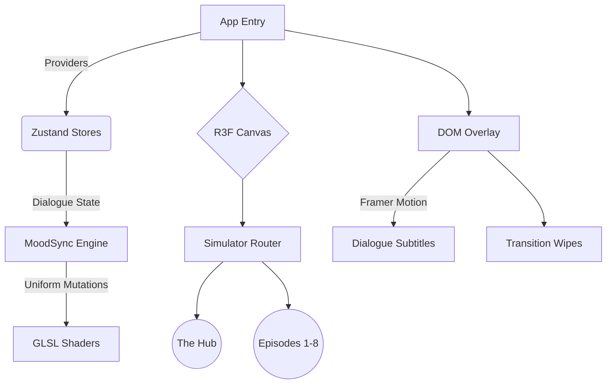

  
  
   
   

  <h2 align="center"><b>Interactive 3D Multiverse Simulator</b></h2>
  
  

    <strong>A high-performance, WebGL-powered interactive narrative engine adapting the philosophical journeys of Clancy Gilroy.</strong>
     
    Built with React Three Fiber, GLSL Shaders, and Zustand.
  

  

    
  

  

    
    
    
    
  

  

## 👁️ About This Project

> *"You are the universe experiencing itself."*

The **Midnight Gospel 3D Simulator** transcends a standard landing page—it is a fully persistent, generative WebGL ecosystem. Inspired by the Netflix animated series and the Duncan Trussell Family Hour podcast, this project reimagines existential, psychedelic interviews as highly interactive, mathematically driven 3D geometries.

Players spawn into the **Chromatic Ribbon** (the multiverse hub) and dive through diegetic portals into 8 distinct dimensions. In each dimension, custom **GLSL Fragment and Vertex Shaders** listen to the active dialogue state, dynamically mutating the environment (colors, melting effects, speed, and audio-reactive auras) in real-time as the conversation unfolds.

---

## 🚀 Live Experience

The simulation is fully deployed and optimized for both desktop and mobile browsers (targeting 60 FPS). 

**Enter the Simulator:** [midnightgospel.vercel.app](https://midnightgospel.vercel.app)

---

## 🏗️ Architecture Design

The application utilizes a sophisticated React tree architecture to ensure **zero WebGL context loss** during route transitions, ensuring buttery-smooth performance.

### Core Technologies
- **Rendering**: `@react-three/fiber` declarative scene graph over `three.js`.
- **State Engine**: `zustand` completely decoupled from React renders to feed rapid shader uniform updates without thrashing the DOM.
- **Cinematics**: `framer-motion` for accessible, ARIA-compliant HTML overlays.

---

## 🗂️ Dimensional Breakdown

| Level ID | Destination | Core Visual Metaphor | Interactive Element |
| :---: | :--- | :--- | :--- |
| `0` | **Chromatic Ribbon** | Interdimensional Hub | Diegetic Portal Navigation |
| `1` | **Zombie Capitol** | Apocalypse / Mindfulness | Flesh-Melting Shaders |
| `2` | **Baby Clown** | Meat Grinder / Acceptance | Macabre Industrial Geometry |
| `3` | **Cream Ocean** | Magic / Forgiveness | Fluid Dynamics / Liquid GLSL |
| `4` | **Vengeance Kingdom**| Revenge / Non-Duality | Aggressive Spike Vectors |
| `5` | **Soul Prison** | Existential Dread | Isolation Spheres |
| `6` | **Meditation Cave** | Inner Peace | Pulsing Audio-Reactive Auras |
| `7` | **Planet Blank Ball**| Death / Ego Loss | Void Mechanics |
| `8` | **Trainworld** | The Journey | Endless Scrolling Tunnels |

---

## 🛠️ Spec-Driven Development (SDD)

This repository strictly adheres to the SpecKit SDD workflow. Before writing code, all features must traverse the pipeline:
`Constitution -> Specify -> Clarify -> Plan -> Tasks -> Implement`

All foundational specs and automated bash utility scripts are securely isolated in the `.specify` and `.gemini` directories.

---

## 🤝 Contributing

We invite interdimensional travelers to contribute to the lore and shaders!
1. Read the [CONTRIBUTING.md](CONTRIBUTING.md).
2. Create an Issue discussing the feature.
3. Submit a PR against the `main` branch.

  Built with ❤️ and existential wonder. Licensed under MIT.

