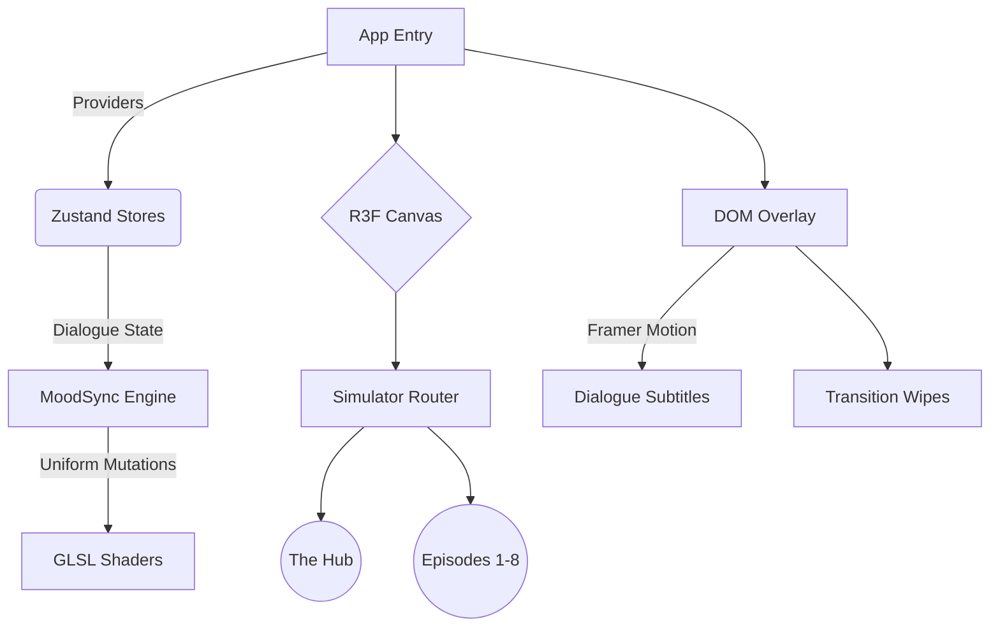

<div align="center">
  
  
  <br />
  <br />

  <h2 align="center"><b>Interactive 3D Multiverse Simulator</b></h2>
  
  <p align="center">
    <strong>A high-performance, WebGL-powered interactive narrative engine adapting the philosophical journeys of Clancy Gilroy.</strong>
    <br />
    Built with React Three Fiber, GLSL Shaders, and Zustand.
  </p>

  <p align="center">
    <a href="https://midnightgospel.vercel.app"></a>
    
    
    
    
  </p>

  <hr />
</div>

## 🌌 The Experience

The **Midnight Gospel 3D Simulator** transcends a standard landing page. It is a fully persistent 3D WebGL ecosystem where players spawn into the **Chromatic Ribbon Hub** and traverse through diegetic portal geometries into 8 distinct dimensions (Episodes). 

Each dimension is mathematically driven by custom fragment and vertex GLSL shaders, mapping the profound dialogue of the original podcast interviews directly into real-time environmental mutations.

---

## 🏗️ Architecture Design

The application utilizes a sophisticated React tree architecture to ensure zero WebGL context loss during route transitions, guaranteeing buttery-smooth 60 FPS performance.



### Core Technologies
- **Rendering**: `@react-three/fiber` declarative scene graph over `three.js`.
- **State Engine**: `zustand` completely decoupled from React renders to feed rapid shader uniform updates without thrashing the DOM.
- **Cinematics**: `framer-motion` for accessible, ARIA-compliant HTML overlays on top of the `<Canvas>`.
- **Development**: Spec-Driven Development (SDD) via `speckit` pipeline.

---

## 🗂️ Dimensional Breakdown

| Level ID | Destination | Core Visual Metaphor | Interactive Element |
| :---: | :--- | :--- | :--- |
| `0` | **Chromatic Ribbon** | Interdimensional Hub | Diegetic Portal Navigation |
| `1` | **Zombie Capitol** | Apocalypse / Mindfulness | Flesh-Melting Shaders |
| `2` | **Baby Clown** | Meat Grinder / Acceptance | Macabre Industrial Geometry |
| `3` | **Cream Ocean** | Magic / Forgiveness | Fluid Dynamics / Liquid GLSL |
| `4` | **Vengeance Kingdom**| Revenge / Non-Duality | Aggressive Spike Vectors |
| `5` | **Soul Prison** | Existential Dread | Isolation Spheres |
| `6` | **Meditation Cave** | Inner Peace | Pulsing Audio-Reactive Auras |
| `7` | **Planet Blank Ball**| Death / Ego Loss | Void Mechanics |
| `8` | **Trainworld** | The Journey | Endless Scrolling Tunnels |

---

## 🚀 Quick Start

Ensure you have Node.js 18+ installed on your system.

```bash
# 1. Clone the multiverse
git clone https://github.com/anubhavaanand/midnightgospel.git
cd midnightgospel

# 2. Install the dimensional dependencies
npm install

# 3. Ignite the simulator
npm run dev
```

Your local instance of the Chromatic Ribbon will now be accessible at `http://localhost:5173`.

---

## 🛠️ Spec-Driven Development (SDD)

This repository strictly adheres to the SpecKit SDD workflow. Before writing code, all features must traverse the pipeline:
`Constitution -> Specify -> Clarify -> Plan -> Tasks -> Implement`

All foundational specs and automated bash utility scripts are securely isolated in the `.specify` and `.gemini` directories.

## 🤝 Contributing

We invite interdimensional travelers to contribute to the lore and shaders!
1. Read the [CONTRIBUTING.md](CONTRIBUTING.md).
2. Create an Issue discussing the feature.
3. Submit a PR against the `main` branch.

<div align="center">
  <sub>Built with ❤️ and existential wonder. Licensed under MIT.</sub>
</div>