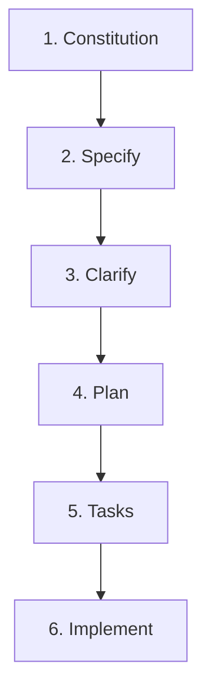

# THE MIDNIGHT GOSPEL: MASTER SDD WORKFLOW & TECH PLAYBOOK

This document establishes the official **Spec-Driven Development (SDD)** workflow, our high-performance **WebGL Stack**, and the **Agent Skills Matrix** utilized to build the immersive Spacecast Narrative Simulator.

---

## 📜 PART 1: THE SPEC-DRIVEN DEVELOPMENT (SDD) PIPELINE
We execute all engineering cycles strictly following the six-stage SDD pipeline to ensure zero-defect development:

### 1.1 Constitution (Immutable Guidelines)
- Establish the visual, architectural, and quality rules of the project.
- Exclude speculative fan theories and ensure a strict, premium visual identity (e.g. anti-generic UI aesthetics, glassmorphism filters, elegant serif and monospace typography).

### 1.2 Specify (Deep Lore & Asset Context)
- Perform comprehensive, deep research on the target domain.
- Ingest canonical source material (transcripts, creator interviews, AMA logs, design documents) using high-fidelity scraping pipelines.
- Compile concrete spec sheets and lore KBs to guide both WebGL visual models and LLM prompts.

### 1.3 Clarify (Decision Alignment)
- Address structural and design ambiguities immediately.
- Formulate interactive options and alignment matrices to resolve target blocks (e.g. bypassing age-gates, choosing reference sites, and managing credits).

### 1.4 Plan (Architectural Sign-off)
- Write a formal `implementation_plan.md` artifact before writing a single line of production code.
- Outlines the precise files to modify/create, detailed component specs, and a robust verification plan.
- **Critical Requirement:** Stop and wait for the User's explicit review and approval.

### 1.5 Tasks (Granular TODO Tracking)
- Once the plan is approved, translate the blueprint into a modular, checkbox-driven list inside `task.md`.
- Mark tasks dynamically as `[ ]` (Unstarted), `[/]` (In-Progress), or `[x]` (Completed).

### 1.6 Implement (TDD Coding & Verification)
- Code with maximum technical rigor. Use Test-Driven Development (TDD) principles.
- Maintain type safety (`npm run type-check`) and run Vitest test suites regularly.
- Provide full visual and terminal-logged evidence of success in a final `walkthrough.md` document.

---

## 🛠️ PART 2: THE HIGH-PERFORMANCE WEBGL TECH STACK
Our frontend application is engineered using a highly decoupled, spatial narrative stack:

- **Core Framework:** React 18 + TypeScript + Vite (delivering near-instantaneous HMR compilations).
- **3D Graphics & Shaders:** Three.js + React Three Fiber (`@react-three/fiber`) + Drei (`@react-three/drei`) for declarative WebGL viewport management and custom shader pipelines.
- **State Management:** Zustand (for lightweight, reactive, global level triggers and dialogue advancement).
- **Animations & Physics:**
  - GSAP (GreenSock) for high-fidelity camera timelines and smooth Z-axis scroll damping.
  - Framer Motion for premium, glassmorphic HTML dialog overlays.
  - `@react-three/rapier` for performant WASM-based 3D collision physics.
  - Theatre.js for granular timeline orchestration.
- **Styling:** Tailwind CSS for modern responsive utility design.
- **AI Orchestration:** Google Gemini API (`gemini-1.5-flash`) for real-time emotional mood-to-portal coordinate translation.
- **Testing Suite:** Vitest for lightning-fast unit verification + Playwright for automated E2E browser tests.

---

## 🧬 PART 3: AGENT SKILLS MATRIX
Below is the mapping of our available powerhouse system skills directly onto our project's tech stack, guiding autonomous subagents through design, execution, and optimization cycles:

| Category | Skill Name | Application to Stack & Project |
| :--- | :--- | :--- |
| **3D Rendering & Geometry** | `threejs-webgl` `react-three-fiber` `r3f-best-practices` | Synchronizing standard imperative Three.js matrices with declarative React nodes. Enforcing optimal `Suspense` and Drei loader patterns to prevent WebGL memory leaks during level warp transitions. |
| **Material & Shader Art** | `threejs-syntax-materials` `threejs-impl-lighting` `threejs-impl-post-processing` | Creating highly tactile PBR materials, fleshy subsurface scattering for the yonic VR Simulator pod, ambient fuchsia/purple glows, and bloom post-processing to represent the show's psychedelic style. |
| **Motion & Scroll Control** | `web3d-integration-patterns` `gsap-scrolltrigger` `react-spring-physics` | Orchestrating mouse wheel and scroll events to drive the camera Z-position smoothly (Chartogne-Taillet layout depth transitions) without causing lag on mobile browsers or conflicting with OrbitControls. |
| **HTML UI & Styling** | `taste-design` `design-taste-frontend` `modern-web-design` `motion-framer` `modern-web-guidance` | Injecting premium typography (serif + monospace monospace dataviews), off-screen layouts, custom Z-depth gauges, tactile glassmorphism variables, and text scrambles. |
| **Diagnostics & Refactoring** | `tdd-red-green-refactor` `typed-service-contracts` `chrome-devtools` `threejs-errors-performance` | Writing robust, fully typed REST endpoints and stores. Diagnosing WebGL render bugs, target connection drops, and optimizing frame-rates to guarantee a steady 60 FPS. |
| **Deployment** | `vercel-cli-with-tokens` | Pushing local builds straight to active Vercel staging environments using direct token integrations. |

---

*Playbook Compiled: May 2026*  
*Project Workspace: /home/anubhavanand/midnight gospel/midnightgospel*  
*SDD Orchestration: Specify CLI + Antigravity AI Engine*  
