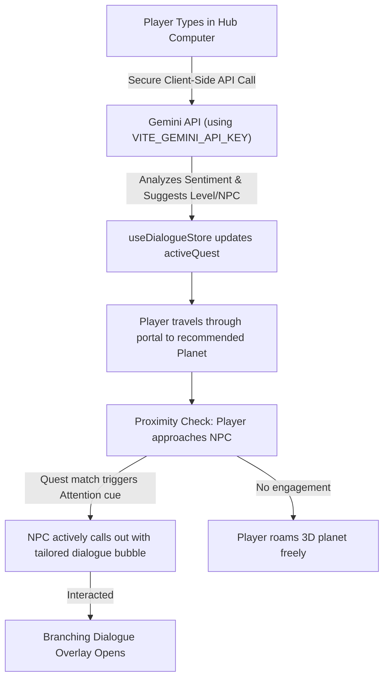

# Spacecast Simulator: AI-Driven Existential Dialogue & Mobile 3D System

## Goal Description
Upgrade the *Midnight Gospel Spacecast Simulator* into an interactive, emotionally intelligent experience. By combining AI-driven sentiment routing in the Simulator Hub with authentic TV-edited podcast transcripts on the planets, players can explore deep philosophical concepts tailored to their real-life state of mind. The experience is optimized for full 3D gameplay across both desktop and mobile browsers.

---

## 1. Architecture & Core Components



### Component A: The Simulator Hub AI
*   **The Interface:** Clancy's organic computer screen with an interactive chat text box.
*   **The Pipeline:** 
    1.  The user inputs how they are feeling (e.g., *"I'm feeling overwhelmed by fear"*).
    2.  The application invokes the Gemini API using `VITE_GEMINI_API_KEY` from `.env.local`.
    3.  The system analyzes the player's emotional state, responds in Clancy's AI computer persona, and assigns a recommended planet and target NPC.
    4.  Updates the Zustand global state (`useDialogueStore.ts`) with:
        ```typescript
        activeQuest: {
          recommendedLevel: LevelId;
          recommendedNPC: string;
          userContext: string; // Brief summary of what user is struggling with
        }
        ```

### Component B: Dynamic NPC Attention System
*   **The Behavior:** NPCs roam around their 3D planets (e.g., Baby Clown Pastures, Meditation Temple).
*   **The Attention Trigger:** When the player gets close (within radius $R$), the NPC checks `activeQuest`. 
    *   If the NPC is the recommended guide, they trigger an dynamic visual bubble above their head: *"Hey Clancy! I heard your heart is feeling heavy today. Let's chat."*
*   **The Freedom:** If ignored, the player can continue exploring the buildings, jumping, and running without interrupting gameplay.

---

## 2. Transcript Sourcing & Scraping Script

To get the absolute raw scripts from the *Duncan Trussell Family Hour* (DTFH) YouTube videos and save them locally without hallucinations:

### Scraper Utility: `scripts/scrape-transcripts.js`
We will run a lightweight Node script utilizing `youtube-transcript` to automatically dump the scripts into `src/data/transcripts/`.

```javascript
// scripts/scrape-transcripts.js
import fs from 'fs';
import path from 'path';
import { YoutubeTranscript } from 'youtube-transcript';

const EPISODE_VIDEOS = {
  1: 'u3F8F99d_iU', // Example DTFH Ep ID (Dr. Drew Pinsky)
  2: 'z1n2m3o4p5q', // DTFH Ep ID (Anne Lamott)
  // ... maps to all 8 episode youtube IDs
};

async function downloadTranscripts() {
  const outputDir = path.resolve('src/data/transcripts');
  if (!fs.existsSync(outputDir)) {
    fs.mkdirSync(outputDir, { recursive: true });
  }

  for (const [episode, videoId] of Object.entries(EPISODE_VIDEOS)) {
    try {
      console.log(`Downloading transcript for Episode ${episode} (Video ID: ${videoId})...`);
      const transcript = await YoutubeTranscript.fetchTranscript(videoId);
      
      const cleanText = transcript
        .map(t => t.text)
        .join(' ')
        .replace(/&amp;/g, '&')
        .replace(/&#39;/g, "'");

      fs.writeFileSync(path.join(outputDir, `ep${episode}.txt`), cleanText);
      console.log(`Saved src/data/transcripts/ep${episode}.txt successfully!`);
    } catch (err) {
      console.error(`Failed to download Episode ${episode}:`, err.message);
    }
  }
}

downloadTranscripts();
```

---

## 3. Decoupled Mobile Input (Touch Joystick)

To support seamless WebGL movement on mobile without lags or stutter:

*   **Decoupled Architecture:** Touch joystick pointer movements are collected as pure data deltas `Vector2(dx, dy)` and saved to an input state store, completely decoupled from character rendering.
*   **Touch HUD Overlay:** A semi-transparent overlay dynamically mounted at the bottom-left of the viewport *only* when touch events are detected:
    ```typescript
    export interface JoystickInput {
      isActive: boolean;
      vector: { x: number; y: number }; // Normalized -1.0 to 1.0 values
    }
    ```
*   **Interaction Model:** We will integrate the user's reference game UI models to structure building entry and NPC dialogues.

---

## 4. Verification Plan

### Automated Tests
1.  **AI Parsing Validation:** Test standard prompts to verify sentiment analysis correctly returns the right level mapping.
2.  **API Connection Check:** Verify client calls to Gemini API exit cleanly without exposing credentials.
3.  **State Updaters:** Validate state updates in the dialogue store when transitioning portals.

### Manual Verification
1.  **Mobile Interface Check:** Run the browser server and simulate touch joysticks in Chrome DevTools responsive mobile layout.
2.  **Transcripts Review:** Open `src/data/transcripts/` and confirm transcripts contain readable text.
