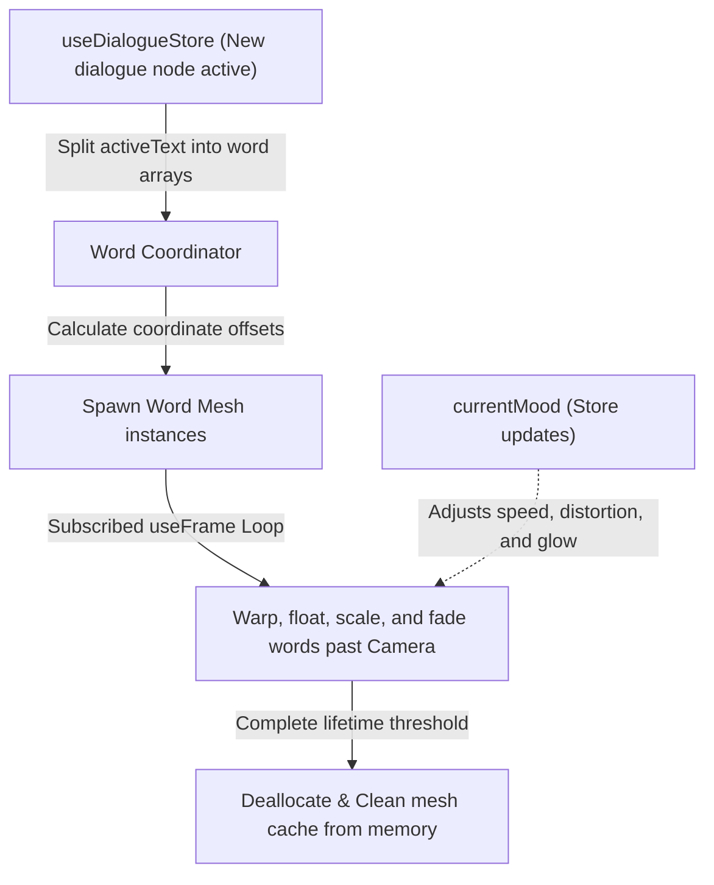

# Spec: 3D Kinetic Typography Dialogue System

This specification defines the design, performance metrics, and implementation plan for the **3D Kinetic Typography dialogue visualizer** (`KineticDialogue.tsx`) inside the *Midnight Gospel Spacecast Simulator*.

---

## 1. Architectural Concept & Interaction Flow

Unlike standard 2D caption overlays, our **Kinetic Typography** renders words as physical, glowing 3D entities in the WebGL world space. Words spawn, animate along responsive curves, distort, and float past the camera lens dynamically based on the active narrative's structural mood parameters.

---

## 2. Dynamic Mood Sync Mapping

The active dialogue node's `mood` dictates the kinetic typography behavior in real-time:

| Mood Property | Dialogue Impact | Physical Mapping in R3F |
| :--- | :--- | :--- |
| **`intensity`** (0.1 to 1.0) | Stress / emotion level | Scale multiplier (1.0 to 3.0), turbulent vibration offset, and floating speed. |
| **`colorTarget`** (HEX) | Sentiment aura | Color tinting and glowing neon outline mapping. |
| **`speed`** (0.5 to 2.5) | Talking speed tempo | Spawning delay intervals and lifetime float velocity. |

---

## 3. Tech Stack & Performance Constraints

1. **Geometry Model:** We utilize `@react-three/drei`'s `<Text />` component which implements highly optimized MSDF (Multi-channel Signed Distance Field) text. This guarantees sharp typography at any zoom level, avoids polygon lag, and eliminates the need to fetch slow JSON typeface fonts.
2. **Animation Engine:** Real-time mathematical interpolation inside `useFrame` utilizing framerate-independent time deltas (`state.clock.getElapsedTime()`). This keeps updates locked at a smooth, stutter-free 60fps on both desktop and mobile viewports.
3. **Memory Control:** Active word arrays are managed reactively. Words that surpass the camera boundaries are automatically unmounted and garbage collected, completely eliminating WebGL memory leaks during long conversations.

---

## 4. Verification Plan

### Automated Verification
* **Zustand Subscription Check:** Verify the component reactively mounts when the store narrative opens and cleanly unmounts when it closes.
* **Type checking:** Ensure type compatibility with our store state structures.

### Manual Verification
* **Aesthetic Visual Verification:** Validate word movement scales, floating curves, and glowing aura shifts match Clancy's trippy theme.
